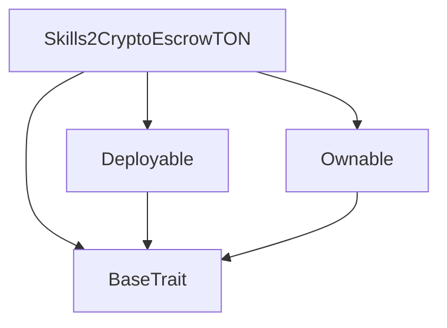

# TACT Compilation Report
Contract: Skills2CryptoEscrowTON
BOC Size: 2314 bytes

# Types
Total Types: 18

## StateInit
TLB: `_ code:^cell data:^cell = StateInit`
Signature: `StateInit{code:^cell,data:^cell}`

## StdAddress
TLB: `_ workchain:int8 address:uint256 = StdAddress`
Signature: `StdAddress{workchain:int8,address:uint256}`

## VarAddress
TLB: `_ workchain:int32 address:^slice = VarAddress`
Signature: `VarAddress{workchain:int32,address:^slice}`

## Context
TLB: `_ bounced:bool sender:address value:int257 raw:^slice = Context`
Signature: `Context{bounced:bool,sender:address,value:int257,raw:^slice}`

## SendParameters
TLB: `_ bounce:bool to:address value:int257 mode:int257 body:Maybe ^cell code:Maybe ^cell data:Maybe ^cell = SendParameters`
Signature: `SendParameters{bounce:bool,to:address,value:int257,mode:int257,body:Maybe ^cell,code:Maybe ^cell,data:Maybe ^cell}`

## Deploy
TLB: `deploy#946a98b6 queryId:uint64 = Deploy`
Signature: `Deploy{queryId:uint64}`

## DeployOk
TLB: `deploy_ok#aff90f57 queryId:uint64 = DeployOk`
Signature: `DeployOk{queryId:uint64}`

## FactoryDeploy
TLB: `factory_deploy#6d0ff13b queryId:uint64 cashback:address = FactoryDeploy`
Signature: `FactoryDeploy{queryId:uint64,cashback:address}`

## ChangeOwner
TLB: `change_owner#819dbe99 queryId:uint64 newOwner:address = ChangeOwner`
Signature: `ChangeOwner{queryId:uint64,newOwner:address}`

## ChangeOwnerOk
TLB: `change_owner_ok#327b2b4a queryId:uint64 newOwner:address = ChangeOwnerOk`
Signature: `ChangeOwnerOk{queryId:uint64,newOwner:address}`

## Deposit
TLB: `deposit#cd32a0f9 matchId:uint256 player1:address player2:address stake:coins = Deposit`
Signature: `Deposit{matchId:uint256,player1:address,player2:address,stake:coins}`

## Settle
TLB: `settle#ddc91d5f matchId:uint256 winner:address reason:uint8 signature:^slice = Settle`
Signature: `Settle{matchId:uint256,winner:address,reason:uint8,signature:^slice}`

## RefundNoShow
TLB: `refund_no_show#58ddc04b matchId:uint256 = RefundNoShow`
Signature: `RefundNoShow{matchId:uint256}`

## SetOraclePubkey
TLB: `set_oracle_pubkey#5cb48f11 newPubkey:uint256 = SetOraclePubkey`
Signature: `SetOraclePubkey{newPubkey:uint256}`

## SetPlatformWallet
TLB: `set_platform_wallet#bef412a4 newWallet:address = SetPlatformWallet`
Signature: `SetPlatformWallet{newWallet:address}`

## SetDepositTimeout
TLB: `set_deposit_timeout#f210d59b seconds:uint32 = SetDepositTimeout`
Signature: `SetDepositTimeout{seconds:uint32}`

## Match
TLB: `_ matchId:uint256 player1:address player2:address stake:coins p1Funded:bool p2Funded:bool firstDepositAt:uint32 status:uint8 = Match`
Signature: `Match{matchId:uint256,player1:address,player2:address,stake:coins,p1Funded:bool,p2Funded:bool,firstDepositAt:uint32,status:uint8}`

## Skills2CryptoEscrowTON$Data
TLB: `null`
Signature: `null`

# Get Methods
Total Get Methods: 5

## getMatch
Argument: matchId

## getOraclePubkey

## getPlatformWallet

## getDepositTimeoutSeconds

## owner

# Error Codes
2: Stack underflow
3: Stack overflow
4: Integer overflow
5: Integer out of expected range
6: Invalid opcode
7: Type check error
8: Cell overflow
9: Cell underflow
10: Dictionary error
11: 'Unknown' error
12: Fatal error
13: Out of gas error
14: Virtualization error
32: Action list is invalid
33: Action list is too long
34: Action is invalid or not supported
35: Invalid source address in outbound message
36: Invalid destination address in outbound message
37: Not enough TON
38: Not enough extra-currencies
39: Outbound message does not fit into a cell after rewriting
40: Cannot process a message
41: Library reference is null
42: Library change action error
43: Exceeded maximum number of cells in the library or the maximum depth of the Merkle tree
50: Account state size exceeded limits
128: Null reference exception
129: Invalid serialization prefix
130: Invalid incoming message
131: Constraints error
132: Access denied
133: Contract stopped
134: Invalid argument
135: Code of a contract was not found
136: Invalid address
137: Masterchain support is not enabled for this contract
1459: Only depositor
3096: Player mismatch
4134: Not expired
7154: Not pending
11127: Stake mismatch
13594: Match not pending
35407: Insufficient TON
36718: Only player
37431: Invalid reason
41660: P1 already funded
43235: Not a player
43564: Only winner can claim
46500: Invalid winner
46751: Invalid oracle sig
53900: Zero stake
54132: P2 already funded
57981: Invalid funding state
60384: Match not found
60944: Same player
61530: Not active

# Trait Inheritance Diagram

# Contract Dependency Diagram

